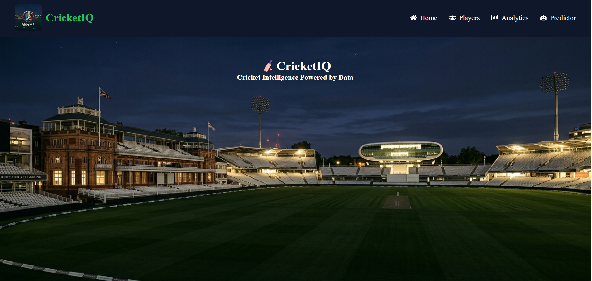
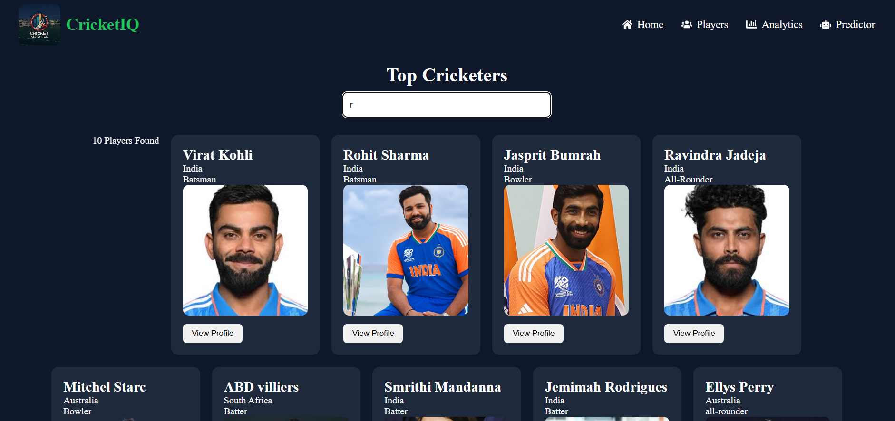
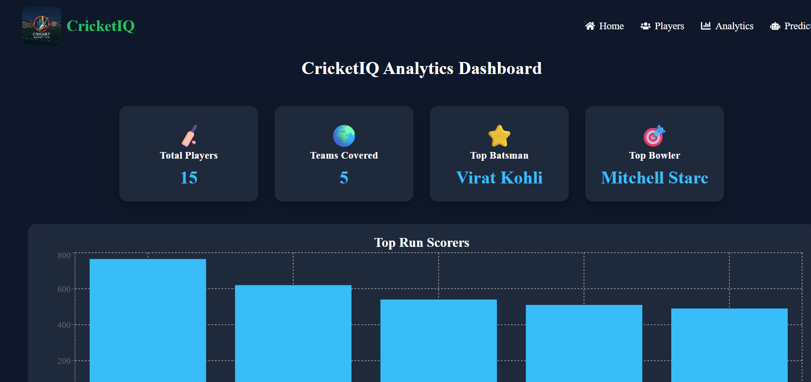
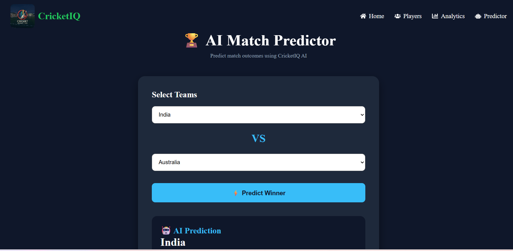

# 🏏 CricketIQ Analytics

A modern cricket analytics platform built using **React** that provides player insights, match analytics, and prediction features through an interactive and responsive user interface.

---
## 🔗 Live Demo

**Live Website:**https://cricket-iq-kappa.vercel.app/

## 🚀 Project Overview

CricketIQ Analytics is designed to help cricket enthusiasts explore player statistics, compare performances, and visualize cricket data through a clean dashboard. The project is currently under active development, with backend integration and AI-powered prediction features planned.

---

## ✨ Features

- 🏠 Modern Home Dashboard
- 👤 Player Profiles
- 📊 Cricket Analytics Dashboard
- 🎯 Match Predictor (UI)
- 📱 Responsive Design
- ⚡ Fast React Components
- 🧭 React Router Navigation

---

## 🛠️ Tech Stack

- React
- JavaScript (ES6+)
- CSS3
- React Router
- Vite

---

## 🚧 Project Status

**Ongoing**

### Upcoming Features

- Backend Integration (Node.js + Express)
- MongoDB Database
- Live Cricket API Integration
- AI-powered Match Prediction
- User Authentication
- Dynamic Player Statistics

---

## 🎯 Learning Outcomes

Through this project, I learned:

- React Components
- JSX
- React Router
- State Management
- Responsive UI Design
- Project Structure
- Git & GitHub

---

## 📸 Screenshots
## 📸 Screenshots

### 🏠 Home Page

### 👤 Players Page

### 📊 Analytics Dashboard

### 🎯 Predictor

---

## 👩‍💻 Developer

**Lahari Nandan**

Computer Science Engineering Student

Passionate about Full Stack Development, AI, and Cricket Analytics.
